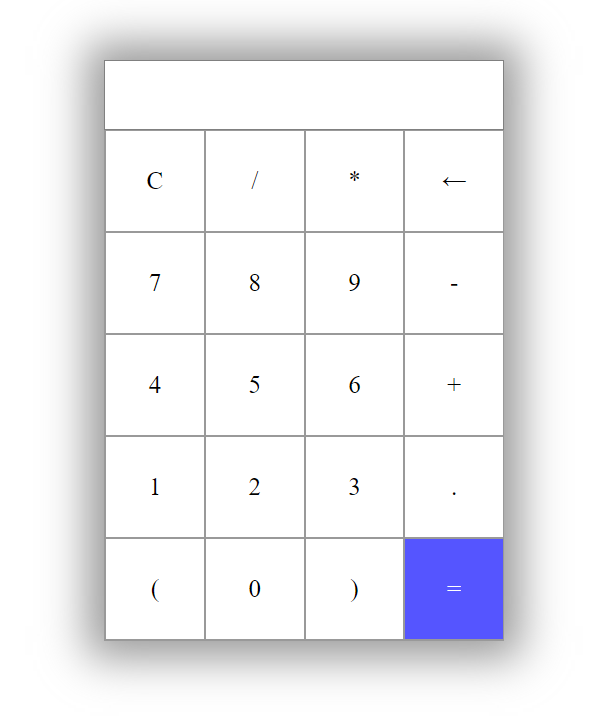
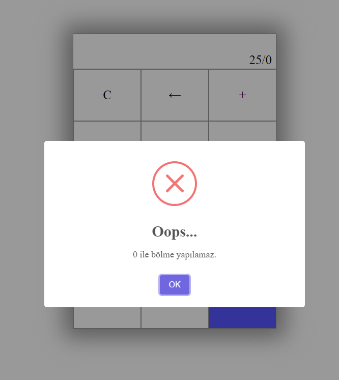
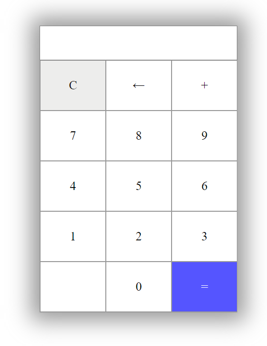
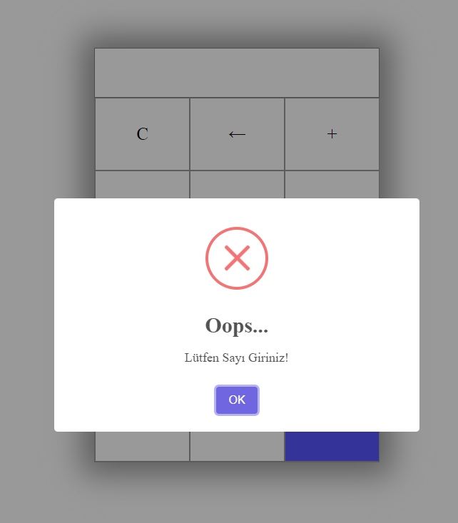

# Calculator App

- 📲 This application has been prepared as an assignment for the Software Engineering course.
- 🛠 This app is developed with HTML / CSS & JavaScript.

___

## 📸 Screnshoots

### ⚡ Last Version

    
     

___    

### ⚡ Second Version

    
    
     

___    

### ⚡ First Version

    
    
     

